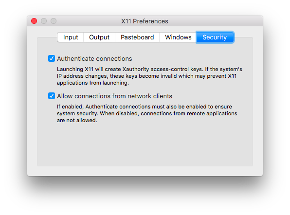

# fireworks-docker

## 1. Setup X11

#### Install XQuartz: 
 

https://dl.bintray.com/xquartz/downloads/XQuartz-2.7.11.dmg

#### Setup XQuartz:
    Start XQuartz and then go to settings (Apple + ,) and go to Security tab, and make sure you've got "Allow connections from network clients" ticked.
#### Then restart iQuartz.

#### XQuartz setting for Mac

Start XQuartz from command line using open -a XQuartz. In the XQuartz preferences, go to the “Security” tab and make sure you’ve got “Allow connections from network clients” ticked:

## 2. Install Docker
Install Docker Desktop
https://hub.docker.com/editions/community/docker-ce-desktop-mac

## 3. Run cmsShow 
Get cmsShowDocker script and run it
 
`curl -O https://raw.githubusercontent.com/alja/fireworks-docker/main/cmsShowDocker`
`cmsShowDocker cmsShow-11.21`
`./cmsShow data.root`

