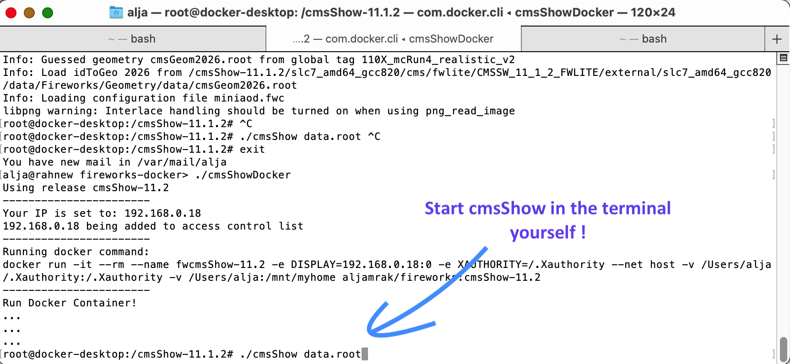

# Running cmsShow with Docker on OSX

## 1. Setup X11

#### Download XQuartz-2.7.11: 
https://dl.bintray.com/xquartz/downloads/XQuartz-2.7.11.dmg<br>
Note: The latest 2.8.0 release still has a lot of issues. Do not update to this version.
#### Install XQuartz and grant all security questions at the install time

#### Configure XQuartz
Start XQuartz from command line using open -a XQuartz. In the XQuartz preferences, go to the “Security” tab and make sure you’ve got “Allow connections from network clients” ticked. Then 'restart' XQuartz


#### Review setting
Check tcp listening and glx is enabled with plutil command
```
 plutil -p ~/Library/Preferences/org.macosforge.xquartz.X11.plist | grep  -E tcp\|glx
```

*If* that is not the case set it command line and reboot your desktop:
```
defaults write org.macosforge.xquartz.X11.plist nolisten_tcp -bool false
defaults write org.macosforge.xquartz.X11.plist enable_iglx -bool true
```
## 2. Install Docker
Install Docker Desktop
https://hub.docker.com/editions/community/docker-ce-desktop-mac

## 3. Run Docker 
Get cmsShowDocker script and run it
<br>
```
curl -O https://raw.githubusercontent.com/alja/fireworks-docker/main/cmsShowDocker
./cmsShowDocker
```
<br>
The default cmsShow version in the docker version is the latest latest. You can specify tarball version in the cmsShowDocker argument.

```
./cmsShowDocker cmsShow-9.4
```
<br>

See  [dockerhub](https://hub.docker.com/repository/docker/aljamrak/fireworks/tags?page=1&ordering=last_updated) for supported versions.


## 4. Run cmsShow in docker
```
root@docker-desktop:/cmsShow-11.1.2# ./cmsShow data.root 
```



##  Issues
The [cmsShowDocker](https://github.com/alja/fireworks-docker/blob/main/cmsShowDocker) scrip is the most simple short script to start Fireworks in docker. Users may need to modify.

### Accessing local files
 * You can access local files by running conainer using mount option. Seem more info at [Docker Mounts](https://docs.docker.com/storage/bind-mounts/)

 * A *docker cp* is also a tool one case use to move root files into the docker


### Default network name
The cmsShowDocker script exact *en0* as the local network. Please edit the network name in the script.
